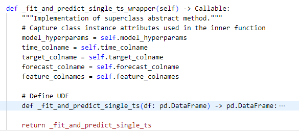

# How to add a new model to Time Series Forecasting Framework?

In this document, we give a brief overview of how models are setup in tsff, and how a developer can add a new one.

Models have been structured in a hierarchical fashion as shown in the image above and it depicts:

- `BaseModel` is structured as an abstract class from which all other models inherit.
- We have two wrapper classes
  - `UnivariateModelWrapper` for univariate models and
  - `MultivariateModelWrapper` for multivariate models
  - Both the classes inherit from `BaseModel`.
  - Additionally, the `MLLibRegressorWrapper` class inherits from `MultivariateModelWrapper` to provide more Pyspark ML models for experimentation.
  - The `RandomForestRegressor` is a child class of `MLLibRegressorWrapper`
- To add a new model, the user data scientist or the developer can create a new model class, inheriting from one of these wrappers if appropriate, else inherit from `BaseModel`. Within this class, specific implementations for fit and predict methods can be added.
- Each model can be specified as an ML algorithm in the configuration file, together with the required hyperparameters.

Below is an example showing a step by step method for the addition of a new model

## Step-1: Add the model package 

This step will enable the application of the algorithm needed for uni/multi-variate model 

- Add the package and the dependencies needed for the model in the requirements file `.azure_pipelines/requirements-pr.txt`
 The figure below illustrates the addition of `prophet package`   

 This will ensure that you have the package installed in the library 

## Step-2 : Create a new python script with the model name 

- Create a new python script for the new model as `[model_name].py` in the folder `tsff/models`
  The figure below illustrates the model prophet.py added to the folder  
 
 

## Step-3:  Import the package libraries and the model wrapper

- Import the necessary package libraries needed for the model in the new file
- Also, import the model wrapper 
  - If the model is univariate import the wrapper as follows: 
   `from tsff.models import UnivariateModelWrapper` 
  - If the model is multivariate import the wrapper as follows: 
   `from tsff.models import MultivariateModelWrapper` 
  - If the model would not need these wrapper classes, import the `BaseModel` 
   `from tsff.models.base_model import BaseModel`

## Step-4:  Create class and the functions

- Create a class for the model object
 Below is an example snippet showing the model class
 Prophet- Univariate 
 
 RandomForest-Multivariate 

- Create function to fit and predict 
  - If the model is univariate, create the function- `_fit_and_predict_single_ts_wrapper` 
  
 This function captures the class instance attributes used in the inner function 
 Within this function, create the UDF(user defined function) with the specific implementation of the new model fit and predict methods for a single time series for the univariate model 
 
  - If the function is multivariate,write the implementation of the individual fit and predict functions of the new model aligned to the multivariatewrapper class. 
   
- The output result of Univariate model should return a pandas dataframe while multivariate should return a SparkDataFrame
- Ensure the output dataframe contains all the columns along with the forecast column

## Step–5 Import the model class in the init file

- As a next step, import the newly defined model class into the `__init__.py` file in the models folder and also add the class in the `__all__` variable list
  

 

## Step-6 Add the model and hyperparameters in the Config dictionary

- Once the new model is added, define the algorithm and hyperparameters in the `model_params` block in the config dictionary. 
Below is an example showing the model_params in the config for Prophet 
 

## Step-7 Add unit tests for the new model

- Write unit test cases for the new model and add it in the path `tsff/test/models`
- Write the script to test independent functionalities written in the new model in the path `tsff/notebooks/module_tests`.

## Step-8 Add Sample Notebook for the model

- Add the sample notebook that illustrates the configuration dictionary schema for the model as  `run_01_create_config_[model_name]` in the path `tsff/notebooks/samples`. 
This notebook will create a parameterized Json configuration file that specifies the experiment parameters.

## Step-9 Raise the PR in Azure DevOps

- Once the new model contribution development is completed, tested and validated to ensure the model class works as expected, raise a PR and add the `tsff` team as required reviewers.
