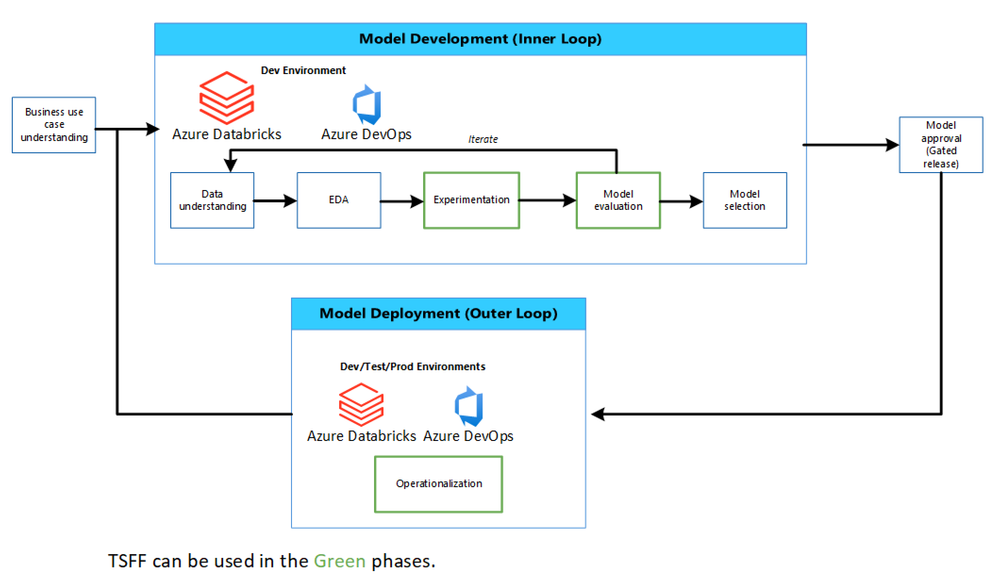

# Time Series forecasting model development lifecycle

Below is a proposed model development lifecycle illustrating how TSFF could be used effectively for time series forecasting. The phases with the green outline indicates where TSFF could be used.

Prior to model development, it is encouraged to work with key stakeholders to understand the business use case. During these discussions, it is important to understand the current forecasting process, data availability, and performance metric(s) from a business perspective that will be used to evaluate the solution. It is also important to understand the proposed use of the forecast output results by downstream processes as well as how and when the forecast results are expected to be available.

## Model development (inner loop)

Model development should begin with a data understanding phase. During this phase, the data sources that are available or have been considered previously for forecasting should be identified and reviewed. It is important to understand the source, the creation and the use of the data. It is also important to understand when data is refreshed, known data quality issues and business rules associated with the data. During this phase, potential data sources can be identified and data quality issues documented. Exploratory Data Analysis (EDA) should be conducted to understand data profiles and formulate experimentation hypotheses that could yield acceptable model performance.

During the experimentation phase, user data scientists may require quick iterations to validate experimentation hypotheses, formulated during EDA. User data scientists may leverage TSFF functionality illustrated in the "notebooks/how_to_use_tsff/using_your_own_df_for_tsff.py" notebook or specific TSFF modules illustrated in "notebooks/module_samples". Data scientists may experiment in notebooks and develop new feature engineering techniques as well as new modelling approaches not available in TSFF. When the user data scientist is satisfied with the model performance, TSFF walk forward cross validation functionality can be leveraged to evaluate the model across several folds. During experimentation, it is recommended to use MLFlow to save model artifacts and performance metrics. It is recommended to have a gated release of a model to target environments such as `test` or `production`. Lead data scientists and business stakeholders should be required to approve a model for `test` and `production` release.

## Model deployment (outer loop)

During the model deployment or operationalization phase of the development lifecycle, the data scientist prepares the codebase for operationalization. This entails modularizing the notebook code, and contributing (if any) new feature engineering or modelling code to TSFF. Additionally, unit tests for new functionality and the detailed TSFF configuration file should be developed.

Operationalization also involves developing Python scripts (`train.py` and (if needed) `score.py`) for MLOps, considering the prior logic in the notebooks developed during `experimentation` phase. These scripts should use relevant TSFF modules. Unit tests should be developed for new TSFF functionality. Unit tests are also required to test the `train.py` and `score.py` code.  

Once the scripts are developed and peer reviewed as well as approval from lead data scientists and business stakeholders have been received, `train.py` and `score.py` scripts are deployed to target environments (test, pre-production, production environments) with TSFF package. It is recommended that model monitoring is enabled to ensure the forecasting solution is performing as expected and also to ensure data scientists are notified when the model requires retraining.

Once the model does require retraining, it is encouraged to conduct `data understanding` and restart the model development lifecycle.
