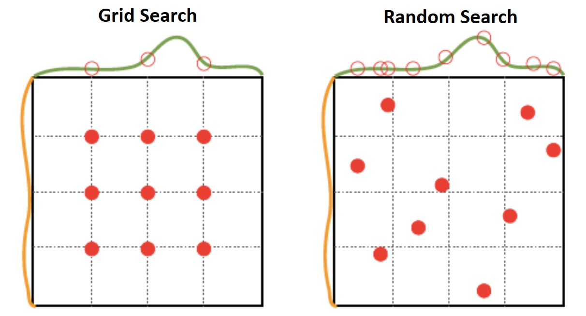

# Hyperparameter Tuning - Part 1: Methods and Recommendations

Hyperparameter tuning is an important part of many ML techniques. It shares many similarities with model selection overall; instead of selecting between different model types (GBM, Linear, etc.), we are choosing the optimal set of hyperparameters for a single model type. As such K-folds cross validation is also the standard method for hyperparameter tuning, in order to prevent the tuning/selection process from overfitting to one specific subset of the data.

This doc outlines the proposed hyperparameter tuning implementation for the Model Experimentation and Evaluation framework. Note that this is not an in-depth discussion on the different ways to perform hyperparameter tuning.

## Overview of Hyperparameter Tuning Methods

For most practical applications, hyperparameter tuning can be performed in the following ways:

1. **Manually**: Individual practitioner manually selects model hyperparameters based on their examination of the data and diagnostic tools.
    - Example: Modeler selects an Arima(1, 0, 1) model after inspecting the ACF and PACF charts of a time series.
2. **Grid Search**: An automatic process to systematically search through a pre-defined space for all hyperparameters being tuned. This process is computationally intensive but can be parallelized. The more hyperparameters there are, the longer the tuning time will be.
    - Example: Tuning the max_depth, min_impurity, sub_sample, col_sample, etc. in a tree-based model.
3. **Random Search**: Similar to grid search, except instead of systematically searching over every combination of hyperparameters in the defined space, we randomly sample from the space of hyperparameters. This is less computationally intensive than grid search and is generally preferred when the number of hyperparameters to tune is large.
    - Example: Tuning the long list of hyperparameters available in neural network models (each layer's size, activation function, dropout, batch norm, etc.)

The following is a visualization of the difference between Grid Search and Random Search:  


It's worth mentioning that there are other "smart" hyperparameter tuning methods (such as Bayesian optimization) which are meant to more intelligently search through the hyperparameter possibilities. However, these are much less parallelizable, and it's difficult to say if they can outperform random search if random search can be parallelized.

In practice, sklearn's GridSearchCV or RandomSearchCV methods are frequently used. However, these automatically perform CV and thus it is difficult to use custom-defined CV folds with default sklearn methods. Thus, we propose implementing our own `tune()` method for the models in our framework, which runs a basic grid search over a pre-defined set of hyperparameters provided in the config.

## Implementation in Framework

The following is an example of how hyperparameter tuning can be implemented in the Model Experimentation and Evaluation framework.

### 1. Define hyperparameters and search space

First start by defining the list of hyperparameters as well as the search space in the config file.

``` JSON
"ml_algorithm": "random_forest",                 # Random forest example here
...
"hyperparameters": {                             # Define list of hyperparameters and their default values
    "n_estimators": 10,
    "max_features": "auto",
    "max_depth": 100,
    "min_samples_split": 2,
    "min_samples_leaf": 4,
    "bootstrap": false
},
"tune_hyperparameters": true,                    # Specify whether or not to tune hyperparameters
"hyperparameter_tuning_ranges":{                 # Define hyperparameter search space (only used if tune_hyperparameters = True)
    "n_estimators": [10, 25, 50, 75, 100],
    "max_features": ["auto", "sqrt", "log2"],
    "max_depth": [10, 20, 30, 40, 50, 60, 80, 100, "None"],
    "min_samples_split": [2, 4, 8, 16],
    "min_samples_leaf": [1, 2, 3, 5, 8],
    "bootstrap": [true, false]
},
```

Note: instead of explicitly defining all values in a list, we can also define a range of values and a step size. For example:  
`n_estimators: {(10, 50), 10}`  is the same as  `n_estimators: [10, 20, 30, 40, 50]`

### 2. Implement tuning method in modeling class

Next, the `hyperparameter_tune()` method in the modeling class will perform the hyperparameter tuning search.

```Python
# For simplicity, this example uses grid-search. We can also implement random-search if we choose.

from sklearn.ensemble import RandomForestRegressor
from sklearn.model_selection import ParameterGrid      # If doing random-search, we'd use ParameterSampler
import numpy as np

class RandomForestModel:
    def __init__(self, model_config: ConfigParserModelTraining):
        # Load in config file...

    def single_cv(self, model, cv_folds):
        # Single iteration of a cross-validation. Fits a given model across the different CV folds and reports the average metric...

    def hyperparameter_tune(self, cv_folds, hyperparameter_tuning_ranges):
        ''' Run hyperparameter tuning over search space, using defined CV folds. '''

        # Define hyperparameter search space:
        search_space = ParameterGrid(hyperparameter_tuning_ranges)

        # Run through search space using CV, keep track of best (minimum) error so far:
        best_hyperparams = None
        best_metric = float('inf')
        for hyperparam_set in search_space:
            model = RandomForestRegressor(**hyperparam_set)
            cv_metric = self.single_cv(model, cv_folds)
            # If better than current best, update best:
            if cv_metric < best_metric:
                best_hyperparams, best_metric = hyperparam_set, cv_metric

        # Return best set of hyperparameters:
        return best_hyperparams
```

### 3. Update model fit function accordingly

Update the rest of the class to use `hyperparameter_tune()` if requested.

```Python
    # Continuing from above:

    def fit(self, X_train: pd.DataFrame, y_train: pd.DataFrame):
        ''' Fit function, either via default hyperparameters or via hyperparameter_tuning. '''

        if self.tune_hyperparameters:
            # If tune = True, run through hyperparameter tuning:
            hyper_params = self.hyperparameter_tune(self._model_config.cv_folds, self._model_config.hyperparameter_tuning_ranges)
        else:
            # Otherwise, set to default hyperparameters:
            hyper_params = self._model_config.hyperparameters

        # Fit model:
        self.model = RandomForestRegressor(**hyper_params)
        self.model.fit(X_train, y_train)
        self._is_fit = True

    def predict(self, X_test: pd.DataFrame):
        # Predict function...
```

## Recommendation

Regarding the different hyperparameter tuning methods discussed, most data science practitioners are leaning towards random search. While grid search is the most comprehensive, it is also very computationally intensive, thus making it only really practical for low-dimensional search spaces.. (The example search space provided above already has 5400 different possibilities to search through!) Random search is typically able to achieve near-best results in a fraction of the time (Bergstra, et al.). *As such, we recommend implementing the random search method for hyperparameter tuning.*

## References

- **Paper on Random Search:** Bergstra, et al. [Random Search for Hyper-Parameter Optimization](https://www.jmlr.org/papers/volume13/bergstra12a/bergstra12a.pdf). Journal of Machine Learning Research, 2012.

- **Blog post on Grid Search vs. Random Search:** Alize Zheng. [How to Evaluate Machine Learning Models: Hyperparameter Tuning](https://web.archive.org/web/20160711095709/http://blog.turi.com/how-to-evaluate-machine-learning-models-part-4-hyperparameter-tuning)

- **Blog post on implementing Random Search vs. Grid Search in a Random Forest model:** Will Koehrsen. [Hyperparameter Tuning the Random Forest in Python](https://towardsdatascience.com/hyperparameter-tuning-the-random-forest-in-python-using-scikit-learn-28d2aa77dd74). 2018.
