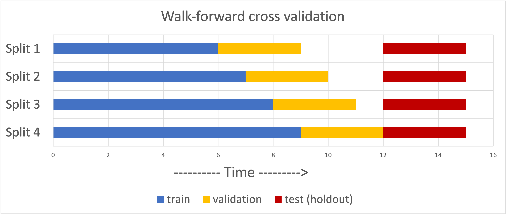

# Model Experimentation And Evaluation Recommendations

This document provides an overview of the different model experimentation and evaluation approaches that can be considered for time-series forecasting.

## Introduction

Based on the various approaches considered, the document recommends the rolling origin (walk forward) cross validation approach for time series forecasting to ensure the models are trained as well as validated considering many time slices. Additionally, it is recommended that all models for the same forecasting scenario must use the same time period for model experimentation and model evaluation. This will ensure models are evaluated consistently on the same time-series data. Additionally, consistent evaluation will assist in establishing business confidence and credibility in the model forecasts.

## Time-Series Forecasting

Assume there is a time-series comprising of 15 time-steps as illustrated below. Time-steps can be specific time periods such as one week or one month. Additionally, the requirement is to forecast 3 time-steps ahead.

To achieve this:

1. The first step is to set aside a test (“holdout”) set. In this example, the final 3 time-steps of data are selected as the test set, illustrated in red.
2. During model experimentation, holding out this test set means that it will NOT be included in ANY of the model training, hyperparameter tuning steps on validation dataset. This test set is expected to be unseen (a black box) to the model.
3. The test set will only be used to do inference – computing and reporting the final performance of a trained, tuned model. It is important to keep this “hidden completely” so that the model performance can be simulated and an estimation of the model performance in future can be determined.

## Static Train and Validation Dataset Approach

To train and evaluate a model, the non-test dataset is split into train and validation datasets. In the example above, the first 9 time-steps are assigned as the train set (in blue) and the last 3 time-steps are assigned as validation set (in yellow). A typical approach during model experimentation, is to train our models on the train set and then evaluate performance on the validation set. Thereafter, the experimentation process would continuously iterate using different machine learning algorithms. Hyperparameters are tuned on validation using techniques such as grid search.

Best model selection, considering different machine learning algorithms, is conducted using validation dataset forecasts. The best model, with the tuned hyperparameters identified on the validation dataset, is retrained on non-test set (blue and yellow). Thereafter, using the retrained model, inference is conducted on the test set (red). Model performance is reported on the test (holdout) dataset forecasts. To prepare for production deployment and forecasting future time periods, the same model is retrained on the entire dataset, including the test set.

## K-Fold Cross Validation Approach

Using a single validation set is often insufficient to arrive at a sufficiently robust model. By partitioning the available data into three sets, we also drastically reduce the number of samples which can be used for learning the model. Also, trying to tune a model on a single static validation set might result in model overfitting to that specific set, i.e., results can depend on a particular random choice for the pair of (train, validation) sets. This may not generalize well to unseen future data. As illustrated below, a typical solution in such a scenario is to do K-Fold cross validation.

Similar to the previous example, assume there is a time-series dataset comprising of 15 time-steps and 4-fold cross validation is considered.

To accomplish this:

1. The first step is to choose a test (“holdout”) set. In this example, the last 3 time-steps of data (in red) are selected as the test set. This is our future unseen set.
2. During model experimentation, the model is trained, validated, and tuned on just the first 12 time-steps of data. To do 4-fold cross validation, the 12 time-step data is split into 4 folds: Training with 3 blue folds (9 time-steps here) and one validation fold of 3-time-steps (yellow). This is an unshuffled 4-fold approach.
3. This results in setting up 4 different splits of the data. One could also split the data with random shuffling of examples into train-validation folds.
4. For each split, multiple models with different hyperparameters are trained on the blue parts of the data and predictions are made on the left-out yellow validation fold.
5. The model with hyperparameters that result in the lowest average error across all 4 validation folds is selected as the best model. Additionally, the chosen model architecture is frozen.
6. This chosen model is then retrained on all non-test data. Thereafter, inference on the test (holdout) dataset is conducted. Model performance is reported on the test (holdout) dataset forecasts.
7. To prepare for production deployment and forecasting future time periods, the same model is retrained on the entire dataset, including test set.

### Advantages

- Considering a diverse set of examples in both training and validation folds mitigates model overfitting.
- If model does not do well on certain validation folds, this lets us diagnose errors on different portions of the data and iterate on model approaches more effectively.

### Disadvantages

One of the main disadvantages of K-fold cross validation in the context of time-series data is data leakage. Data leakage can cause you to create overly optimistic if not completely invalid predictive models. Data leakage is when information from outside the training dataset is used to create the model, i.e., future data. This additional information can allow the model to learn or know something that it otherwise would not know and in turn invalidate the estimated performance of the mode being constructed.

For a forecasting problem, the expectation is that a model is trained on data occurring in the past with an ability to forecast for the future. However, for k-fold cross validation, data could be randomly shuffled into folds with parts of the training set occurring AFTER the validation set. This is akin to model learning patterns from the future in order to predict the past and creating a situation for leakage.

## Rolling Origin (Walk-Forward) Validation

As illustrated below, to address the disadvantages of the k-fold cross validation approach, a cross validation approach appropriate for time-series forecasting problems should be considered.

Similar to the k-fold cross validation, assume there is a time-series comprising of 15 time-steps with an intent to forecast 3 time-steps in the future. Again, a test (holdout) set (in red) is selected and reserved. As before, during model experimentation, the model will be trained, validated, and tuned on just the first 12 time-steps of data.

To do “walk-forward” (rolling origin) validation:

1. As illustrated above, 4 splits are considered. For the first split, take first 6 time-steps of data and use it to train a bunch of models, generate forecasts for months 7, 8, 9 (validation fold), and evaluate how each model performs.
2. Thereafter, an addition time-step (time-step 7) is added to the training dataset. All models are retrained. Forecasts are computed on the new validation fold (time-steps 8, 9, 10). Model evaluation is conducted on the validation fold.
3. (Repeat the above process 2 more times, adding another time-step to the training data each time and shifting the evaluation period out by one time-step.)
4. For the 4th split, use first 9 time-steps for training and the last 3 time-steps for validation of the non-test data.
5. In this example, using this walk forward procedure described, yields at max 4 validation datasets on “out-of-sample” model performance for each model trained. Model evaluation, hyperparameter tuning, and model selection is performed considering these validation datasets. Note, the test (hold out) set is not considered in this analysis.
6. Once the best hyperparameters and model across the 4 splits is identified, the best model, using the best hyperparameters, is retrained on all non-test data. Thereafter, inference on the test (holdout) dataset is conducted. Model performance is reported on the test (holdout) dataset forecasts.
7. To prepare for production deployment and forecasting future time periods, the same model is retrained on the entire dataset, including test set.

### Considerations

An important point to note when implementing this approach: When computing lagged features, we need to be cautious and ensure lags are not computed on future values.

Although the walk-forward approach is quite appropriate for time series cross validation, here is one shortcoming: Since we are walking forward one time step at a time, and parts of the validation set gets added to training in successive splits, there are overlaps between successive validation folds which would result in a model placing more emphasis on certain patterns and memorizing them.

### Advantages

- In FLNA ticket sales data, our granularity is in weeks whereas in Benelux, it is in months. This would mean we “walk forward” one week at a time in FLNA rather than one month at a time in Benelux. This would give us a lot more instances of “out of sample” model performance to help tune and improve our models on the same 12 months (52 weeks) of data in case of FLNA.
- Further, we actually have around 5 years of FLNA data - over 360 weeks of training and validation data, and hiding away the final 12 weeks of data completely as holdout.

## Blocked Time-Series Splitting Approach

As an alternative, consider the blocked cross-validation approach as visualized below:

Similar to the previous examples, last 3 time-steps of data (red) are considered as test (holdout) dataset. However rather than walking forward one step at a time, the non-test set is subdivided into disjointed training and validation folds. This would be the same as walking forward “train+validation” time-steps to select the next data split.

For example, to create 3 splits of 6 time-step training and 3 time-step validation sets, at least 27 time-steps of data are considered so that validation from the previous split doesn’t leak over to training in the next split. Also, another layer of leakage cutoff can be introduced by specifying a “margin” window between validation set of one-split and training of the next one. Once this training, validation splits are set up, the same cross validation approach with model updates, hyperparameter tuning and evaluation on validation folds as in previous approaches is followed.

Once the most appropriate model architecture and hyperparameters are identified using the validation folds, a model is trained on the entire non-test datasets. Thereafter, inference on the test (holdout) dataset is conducted. Model performance is reported on the test (holdout) dataset forecasts. To prepare for production deployment and forecasting future time periods, the same model is retrained on the entire dataset, including test set.

Note that a major disadvantage of this approach is the need to have plenty of data to be able to create enough disjoint folds and having validation sets to evaluate. Given we may not have enough time steps for many of the products in certain regions, this may not be a viable approach even at the granularity of 375 weeks of FLNA data for many mature products.

## Recommended Model Experimentation and Evaluation Approach

The below figure illustrates the model experimentation and evaluation approach to use for time-series forecasts.

Due to the volume of data available, it is recommended to use rolling-origin (walk forward) cross validation approach. During model experimentation, the train and validation sets are used with the cross-validation analysis to identify the best model. Model evaluation and comparison of results with business is performed on test (holdout) set.

Once the model is approved by lead data scientists, the model is retrained on all data (train, validation, and test sets) and deployed as per MLOps design.

It is important that all models for the same forecasting scenario (same time-series, region) must be compared on the same dataset, i.e., all models for the same forecasting scenario must use the same time period for model experimentation and model evaluation. This will ensure models are evaluated consistently on the same time-series data.

References

1. [https://scikit-learn.org/stable/modules/cross_validation.html]
