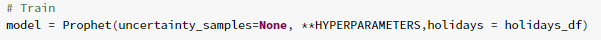
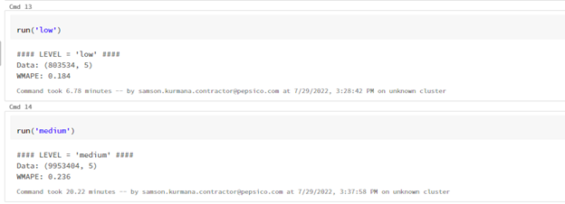
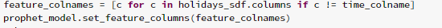
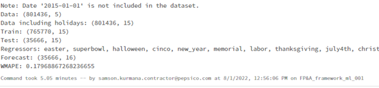
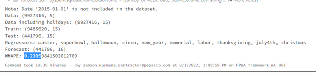

# Exploring ways to integrate holidays into Prophet

This document considers a few different ways we can integrate holiday features into the Prophet model:

1. **model = Prophet(holidays=holidays)**
    - Creating a holidays dataframe with the dates specified. It has two columns (holiday and ds) and a row for each occurrence of the holiday.
    It must include all occurrences of the holiday, both in the past (back as far as the historical data go) and in the future (out as far as the forecast is being made). If they won’t repeat in the future, Prophet will model them and then not include them in the forecast.
    - We extend the holiday out to [lower_window, upper_window] days around the date.
2. **model.add_regressor(<holidays_columns>)**
    - Here, the main dataframe includes one or several columns that indicate whether there is a holiday or not for the date.
    - These columns need to be present in both the train and test dataframes.
    - Add these holiday columns to the model as regressors.
3. **model.add_country_holidays(country_name='US')**
    - In Prophet, we can use a built-in collection of country-specific holidays using the add_country_holidays method. The name of the country should be specified, and then major holidays for that country will be included in addition to any holidays via the holidays argument.
    - However, this approach is quite restrictive since we can no longer decide what holidays to include

## Reference

- [Seasonality, Holiday Effects, And Regressors](https://facebook.github.io/prophet/docs/seasonality,_holiday_effects,_and_regressors.html)

The following is the list of Holidays and Events included in the modeling:  
 | Holidays List| |
 | --- |---|
 |Easter|Memorial Day|
 |Superbowl|Labor Day|
 |Halloween|Thanksgiving|
 |Cinco|July 4th|
 |New year|Christmas|

## Dataset

The following are the datasets used for testing the Prophet Model integrated with holidays.

 |Table_Type|Table_Name                                              |Size|
 |---  | --- | --- |
 |small|finance_fpna_ai_exp_framework.tb_flna_pnl_bdc_size_cdv_region|2.1k grains|
 |medium|finance_fpna_ai_exp_framework.tb_flna_pnl_bdc_size_cdv_zone_id|26k grains|
 |large|finance_fpna_ai_exp_framework.tb_flna_pnl_bdc_cdv_cust_grp_region|1.7M grains|

### 1. model = Prophet(holidays=holidays)

First start by defining the list of hyperparameters as well as adding the holidays dataframe defined manually with the lower and upper bounds.

```JSON
"christmas": {                                       # A sample of holiday and days defined in the dataframe
            "ds": [
                "2015-12-25",
                "2016-12-25",
                "2017-12-25",
                "2018-12-25",
                "2019-12-25",
                "2020-12-25",
                "2021-12-25",
                "2022-12-25",
                "2023-12-25",
            ],
            "lower_window": -21,                     # Lower and upper bound to extend the holiday dates
            "upper_window": 7,
        }
```

**screenshots**<br>
<br> Model_Code<br><br>

<br><br>
Execution<br><br>


|DATASET|DURATION|WMAPE|
| ---    |---       |----|
|LOW |6.78 mins |0.184|
|Medium |20.22 mins |0.236|

### 2. model.add_regressor(<holidays_columns>)

Create a holidays_sdf Dataframe with one row for each Sunday and one column for each
            holiday type, with value 1 if holiday and 0 otherwise with time column also included.

**screenshots**<br>
<br>Holiday_regressor_snippet<br><br>

<br>
Model_Code<br><br>

<br><br>
Execution<br><br>
<br>

|DATASET|DURATION|WMAPE|
| ---    |---       |----|
|LOW|5.05 mins|0.179|
|Medium|10.38 mins |0.2305|

### 3. No Holidays Feature added

The initial model function using the conventional hyperparameters and define- no uncertainty samples.

Model_Code <br>
model=Prophet(uncertainty_samples=None, **HYPERPARAMETERS)

**Screenshots**<br><br>
With No Holidays Feature<br><br>


|DATASET|DURATION|WMAPE|
| ---    |---       |----|
|LOW|1.05 mins|0.1793|
|Medium|5.13 mins |0.230|

## Findings

The WMAPE did not improve significantly when the holidays feature is added<br>
The WMAPE of adding holidays as a regressor or along with hyperparameters didn’t show much of a variation.
