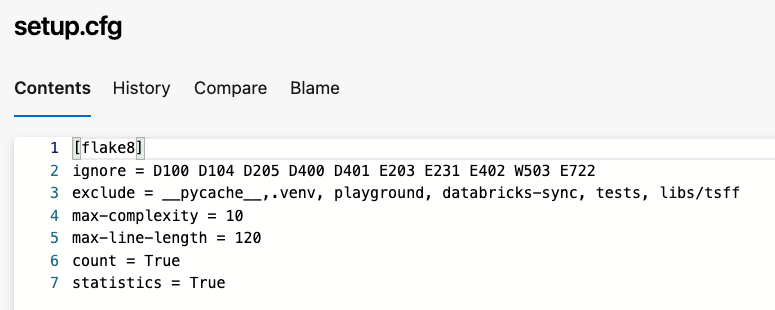
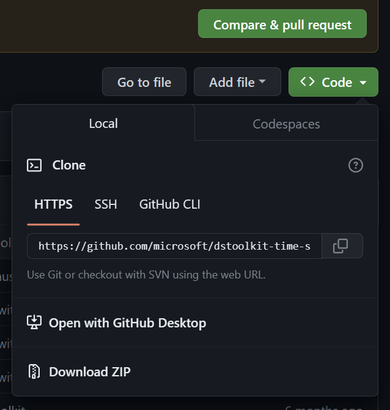
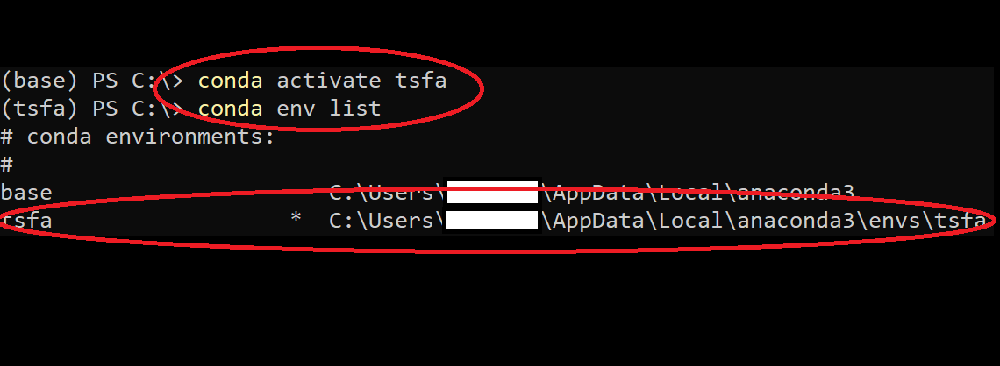
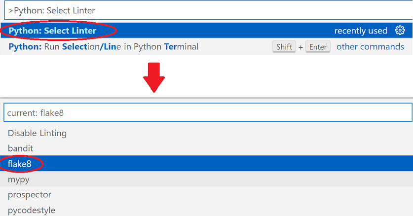
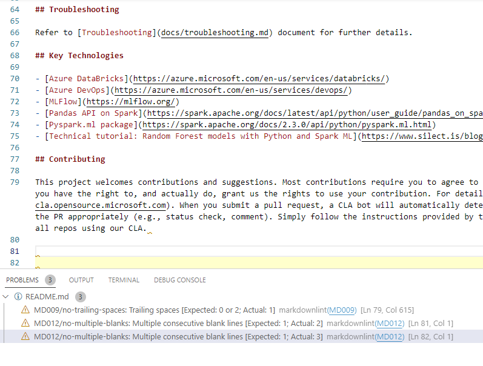

# Setting up local environment

In this document, we include some VSCode setup instructions that will enable and encourage data scientists to develop locally, and maintain best practices. To this end, we recommend installing a few VSCode extensions, namely `Python` and `markdownlint`, test locally before pushing to the remote repository. Local development enables data scientists to evaluate their code for style, conventions, quality and coverage with unit testing. Further, we have code quality pipelines setup on the remote repository that specifically check for these engineering fundamentals when the user pushes code to `main` or `production` branches. Therefore, due diligence to code style and documentation locally minimizes failures on these quality pipelines on the remote.

This document builds on information provided in the [coding standards](./coding_standards.md) document. We added a few more pointers dedicated to local setup.

## Installing Python

Refer to the [Python in Visual Studio Code](https://code.visualstudio.com/docs/languages/python) blog for details on how to install Python and Python extensions such as `Flake8`.

## Python extensions: Flake8 and Markdownlint

For Python linting, we use a popular linter called `flake8` that adheres to commonly accepted rules specified in the [PEP8 Style guide](https://peps.python.org/pep-0008/). To enforce specific rules for our project, we can customize a config file, namely [setup.cfg](../../../setup.cfg) that has been setup at the root directory of the workspace.

To maintain code consistency and quality, its best to reduce the amount of exclusionary linting rules, however every team can jointly decide which rules to ignore and add in the codes to the `ignore` field specified above. You can refer to more configuration options [here](https://flake8.pycqa.org/en/latest/user/configuration.html).

In addition to Python linting, it is required that the user also install the extension [markdownlint](https://marketplace.visualstudio.com/items?itemName=DavidAnson.VSCode-markdownlint).

The configuration file [.markdownlint.yml](../../../.markdownlint.yml) is used to define rules that VSCode settings will utilize to highlight warnings on markdown documents that require linting corrections. This would ensure both Python scripts and markdown documents are verified locally to conform to the quality standards required before evaluating code quality using CI pipelines.

## Setting up local Conda environment

- Make sure to clone this repository locally. You may have to setup SSH keys on Azure Devops in order to be able to access the git repository locally.

    

- In this example, we will name this new conda environment **tsfa**. From the root level of the repository, lets start by creating a conda environment as follows:

    `conda create --name tsfa python=3.8`

- Activate this environment by running:

    `conda activate tsfa`

    You should see that the `tsfa` environment is activated:

    

- Make sure that you have the correct environment activated by running:

    `conda env list`

- To install the python libraries required for local development and testing, use the following `pip` commands to install what you need in the **tsfa** environment. Note that package requirements and dependencies are defined in `tsfa/setup.py`.

    `pip install -e tsfa`

    `pip install -e tsfa[test]`

- For additional libraries useful for local development like jupyter, or any visualization libraries can be specified in the `interactive` field in `setup.py` and installed locally as:

    `pip install -e tsfa[interactive] # Optional`

Troubleshooting:

- If you're on Windows and are unable to activate your conda environment (running `conda activate tsfa` has no effect), try running the above steps in a CMD Prompt instead of Powershell.
- When opening the project in the VSCode Explorer, please select the project's root directory. Flake8 uses the `setup.cfg` file for describing linting rules.

## Using Flake8 and Markdownlint

Once you have your conda environment set up and activated, make sure that you have the correct linter selected in VSCode by opening the Command Palette (Ctrl+Shift+P) and typing `>Python: Select Linter` and then selecting `flake8`.

Once selected, you should be able to see the list of detected issues in the PROBLEMS panel for any .py and .md files that you have open in VSCode.

**Note:** In general, we can specify a default configuration file at the root directory and extend that yaml file with specific `.markdownlint.yml` per sub-directory if need be. VSCode looks for markdownlint configuration files in each directory and will default to the root config file if not specified for a specific sub-directory.
