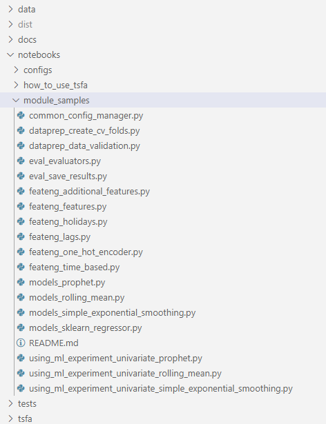
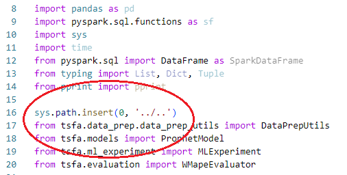
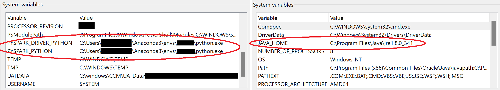

# Testing changes and additions to the Time Series Forecasting Accelerator

TSFA is designed to have an extensible codebase. Users of the accelerator are expected to expand upon the existing capabilities over time by adding new models, feature engineering options, and various other functionalities. To ensure that all changes to the code function as intended, and that changes do not introduce unwanted effects to existing functionalities, developers must ensure that changes are thoroughly tested prior to committing them to `main`. This document outlines the general procedure of how to test your changes during development and how to write/run unit tests to ensure that they continue to function as intended.

There are 2 "testing" topics that this document will cover:

1. Testing that your new changes/additions runs as intended via the `module_samples` notebooks. These notebooks are also used to provide examples of how to leverage individual modules or functionality
2. Adding unit tests for your changes, which will automatically run as part of the CI/CD pipeline.

In addition, please refer to the [Frequency of Regression Testing](decisions/0007_frequency_of_regression_testing.md) ADR document for information related to the method and cadence of end-to-end testing for the TSFA library.

## 1. Testing your changes via the module_sample notebooks

Under `tsfa/notebooks` you will find a `module_samples` directory:

 This directory contains notebooks used to test individual functionalities of TSFA independently and illustrate how to use specific modules or functionality. For example, the notebook `models_prophet` is used to test that the `ProphetModel` class is performing its functions correctly (training a model and predicting on a subsequent dataset). Notebooks in this directory can be used by developers to ensure that their code runs without issues and produces the correct outputs. These notebooks can be leveraged be users to know how to use specific TSFA functionality.

### Important: Import structure for module_samples notebooks

Since the notebooks in this directory are meant to test newly-made changes, we must be able to import these changes properly. Normally, importing modules from the TSFA library simply requires an import statement (e.g. `from tsfa.models import ProphetModel`). However, this will import from the installed TSFA library on the cluster. Instead, we wish to import from the local codebase where we have the changes to test. To do this, we need to insert the path to the `tsfa` root directory to the beginning of the system PATH variables:

This should ensure that you are able to load the changes to be tested.

## 2. Unit testing

Unit testing is a common practice to ensure the quality and reliability of a codebase as it grows and develops. Teams that have a culture of maintaining consistent testing in deployment generally are able to produce higher quality applications with greater efficiency. Unit tests can be run locally or as part of an automated CI/CD pipeline.

Each unit test is a self-contained procedure used to validate that the function, method, or class being tested produces the intended outcome. A "unit" in this case refers to the smallest testable part of an application (for example, a `compute_wmape()` function). It is recommended that developers regularly write/update unit tests for all changes and additions to the code base. Here are some properties of good unit tests to keep in mind:

- Unit tests should be easy to implement.
- Unit tests should be automated and repeatable.
- Anyone should be able to run them at with ease.
- Unit tests should run quickly.
- Tests should should be consistent in their results.
- Each test should be fully isolated (runs independently of other tests).
- Failure messages should be clear; it should be easy to determine the expected result and to pinpoint the problem.

Unit tests for the TSFA library are under the `tsfa/tests` directory:

The TSFA library uses [pytest](https://docs.pytest.org/en/7.1.x/) to do unit testing. Here are some additional resources to guide developers and contributors with developing good unit tests:

- [CSE Playbook: Testing Data Science and MLOps Code](https://microsoft.github.io/code-with-engineering-playbook/machine-learning/ml-testing/)
- [Testing Best Practices for Machine Learning Libraries](https://towardsdatascience.com/testing-best-practices-for-machine-learning-libraries-41b7d0362c95)
- [Unit Testing Best Practices](https://brightsec.com/blog/unit-testing-best-practices/)

Finally, some practical considerations for developing your unit tests:

- Prioritize testing critical components. In TSFA, this means model and feature engineering orchestrators as well as evaluators.
- If a piece of code is getting too complex to write a self-contained test for, think about refactoring it into smaller, more modular components.
- You don't need to unit test everything, but strive for solid test coverage.
- Remember that tests also need to be updated and maintained as the code base evolves.
- A good idea when using **pytest** is to use [fixtures](https://docs.pytest.org/en/6.2.x/fixture.html) whenever there's a need to create some input that the rest of your tests will need.

### Setting up environment for unit testing

**Important:** To begin unit testing in your local environment, be sure that you have your local environment set up correctly (see [setup_local_environment](setup_local_environment.md)). In addition, you may need to do some additional steps depending on your local machine:

- Be sure that [Java](https://www.java.com/en/download/) is installed on your computer.
- Ensure that your system environment variables are set up for python and unit tests. You can edit your system environment variables by typing "Edit the system environment variables" into the Start Menu search bar:

    

- You may also need to set your PYSPARK_PYTHON, PYSPARK_DRIVER_PYTHON, and JAVA_HOME environment variables:

    

### Running unit tests

To run unit tests, you can simply run the following command from the project root directory:

    `python -m pytest tsfa/tests/`

This will run all tests that are in the `tsfa/tests/` directory.

You can also run a specific unit test file by running the `pytest` command with a filename parameter. For example:

    `python -m pytest libs/tsfa/tests/evaluation/test_metrics.py`

### Running unit tests interactively in VSCode (Optional)

If you'd like to discover and run your unit tests interactively using VSCode, you can [view the setup instructions here](https://code.visualstudio.com/docs/python/testing).
