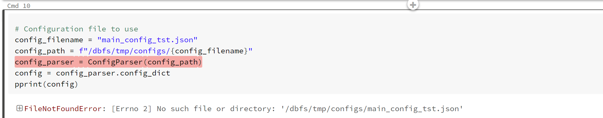
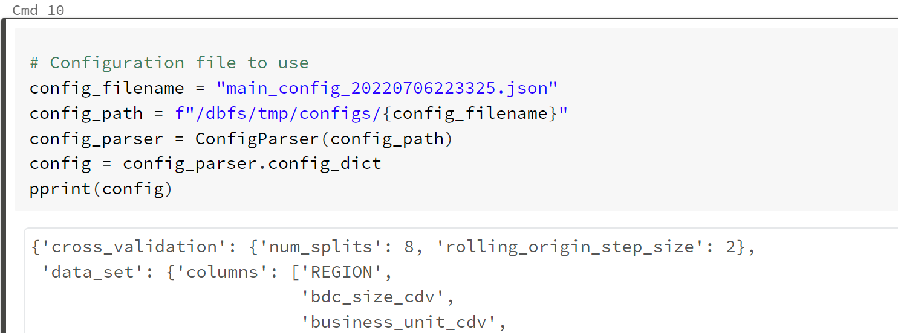
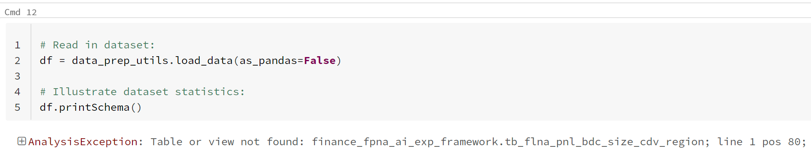
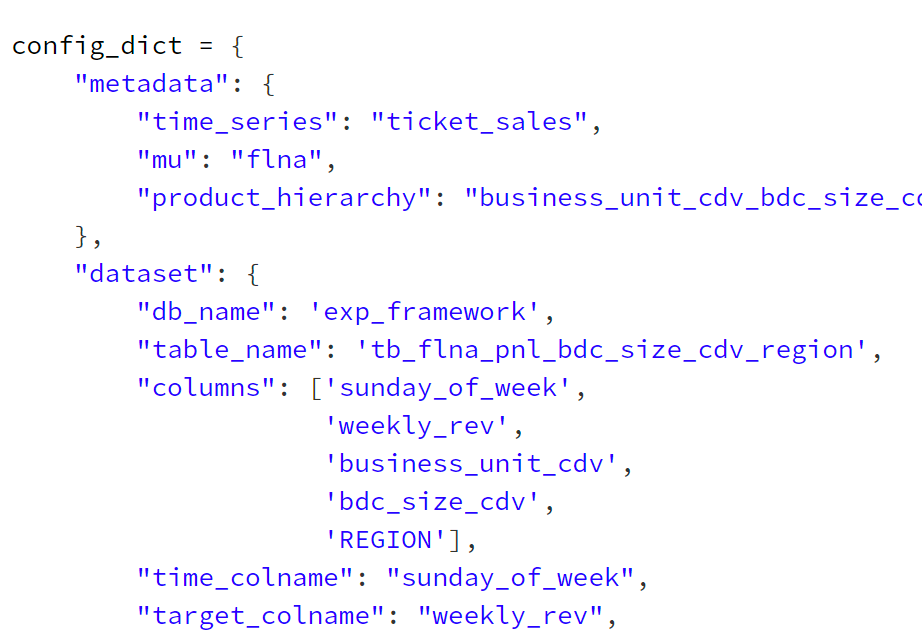
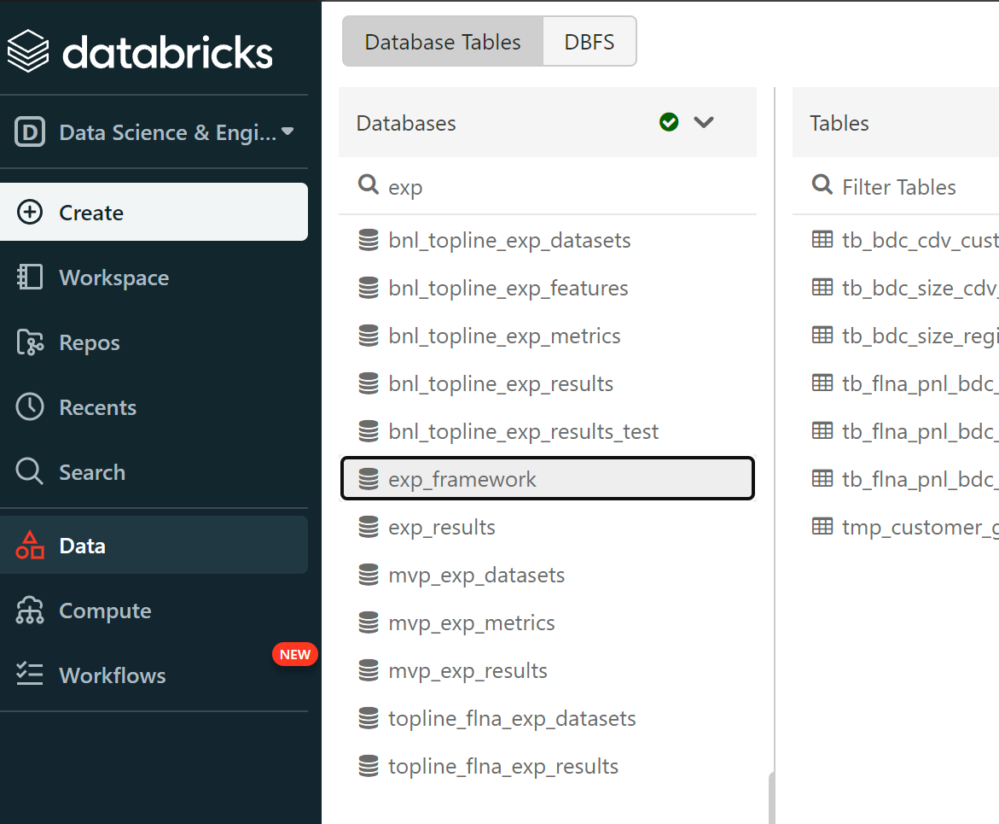

# Troubleshooting guide

When using the experimentation framework, the table below illustrates typical issues:

|#| Issue? | Resolution |
|-|-|-|
| 1 | When executing the `run_ml_experiment_mlflow.py` notebook, the error illustrated below occurs.      | Ensure the `config_filename` and `config_path` variables are assigned to the correct Json configuration file and path, respectively.     |
| 2 | When executing the `create_config_random_forest.py` notebook, the error illustrated below occurs.     | 1. Ensure the configuration dictionary `dataset.db_name` and `dataset.table_name` is set correctly.        2. Ensure the configuration dictionary is set to use a database and table that is accessible to the Azure Databricks cluster being used.     |

It is encouraged for users to work with TSFF code maintainers to collaborate on resolving any issues. Additionally, users are welcome to contribute to this troubleshooting guide to help accelerate resolutions for others to leverage.
