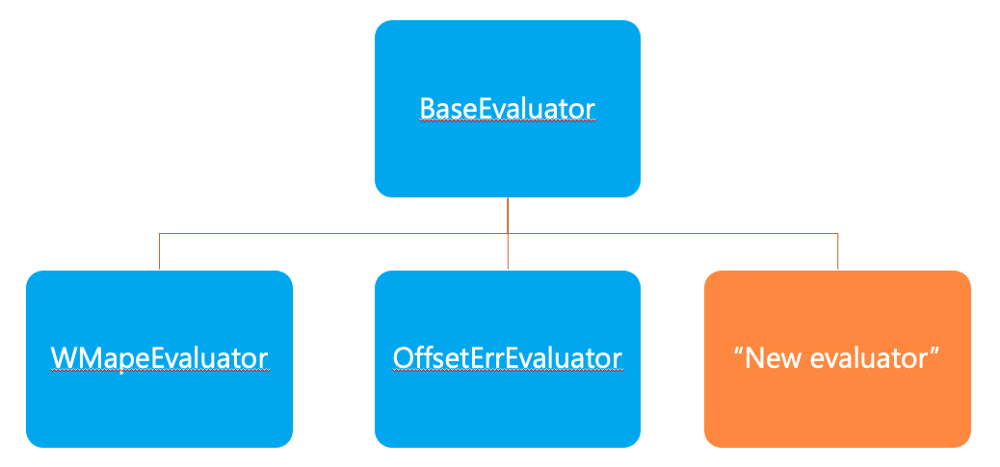

# Evaluation

This module includes implementations of common metrics relevant to time series forecasting. It also contains a function to save the forecast values to a specified database and table. The evaluators are setup in a hierarchical fashion as shown in the image below:

## base_evaluator.py

Implementation of the `BaseEvaluator` class. It defines the interface for all other evaluators and implements a method to compute the specific metric at any granularity level called `compute_metric_per_grain`.

## wmape_evaluator.py

Implementation of the class WMapeEvaluator (Weighted Mean Absolute Percentage Error) and absolute accuracy measures. Inherits from `BaseEvaluator`.

## compound_evaluator.py

Implementation of the `CompoundEvaluator` class that can be used to manage multiple evaluators at once.

## save_results.py

Function to save forecast results to specified database and table.

## Adding new evaluators

A developer can add a different way of measuring forecasting predictions, say Symmetric MAPE. For this, they can create a class for the evaluator, say `SMAPEEvaluator` inheriting from the `BaseEvaluator`. This can be included in an end to end experiment as the sole mechanism for evaluation. We can also include this as one of many evaluators for an experiment by including it in the `CompoundEvaluator`. For modes of use, see [this notebook](../../notebooks/module_samples/eval_evaluators.py).
