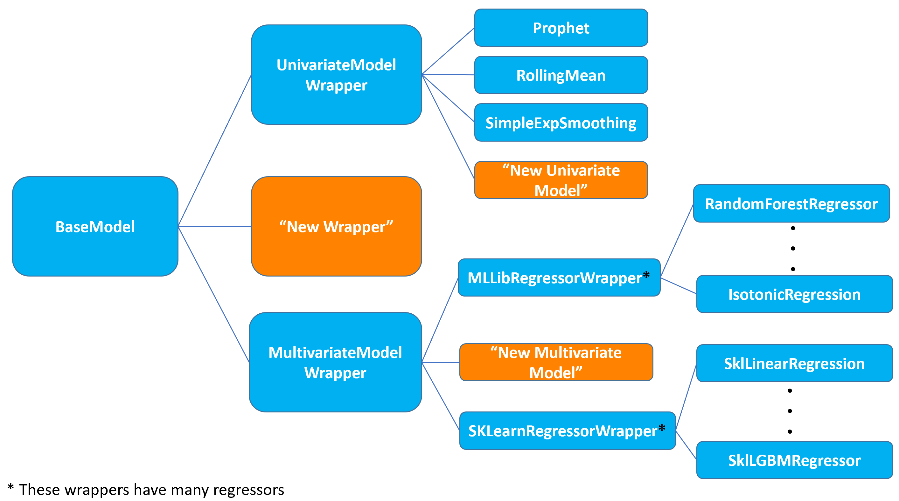

# Models

Module to perform Time Series modeling and forecasting.

This module has been structured in a hierarchical fashion as shown in the image below:

- `BaseModel` is structured as an abstract class from which all other models inherit.
- We have two wrapper classes - one for univariate models (`UnivariateModelWrapper`) and another for multivariate models (`MultivariateModelWrapper`) that inherit from `BaseModel`.
- `RandomForest` is a type of multivariate model, hence inherits from `MultivariateModelWrapper`. `ProphetModel` and `RollingMeanModel` are univariate models, hence inherit from `UnivariateModelWrapper`.
- To add a new model, the developer can create a new model class, inheriting from one of these wrappers if appropriate, else inherit from `BaseModel`. Within this class, specific implementations for fit and predict methods can be added.
- Each model is specified as an ML algorithm in the configuration file, together with the required hyperparameters.

## base_model.py

Implementation of a generic abstract `BaseModel` class with commonly shared functionality among all ML algorithms. This will be a parent class for all other model classes.

## univariate_model_wrapper.py

Implements the `UnivariateModelWrapper` class that is the base class for all univariate models. This has an abstract methods for `fit_and_predict`. Inherits from `BaseModel`. The model training and forecasting approach:

- Operate on a Spark dataframe at specified granularity
- Group by the granularity columns, leverage applyInPandas and train a per time series univariate model on a pandas Series.

## multivariate_model_wrapper.py

Implements the `MultivariateModelWrapper` class that is the base class for all multivariate models. This has abstract methods for `fit` and `predict`. Inherits from `BaseModel`.

## mllib_regressor.py

Implements the `MLLibRegressorWrapper` class that inherits from `MultivariateModelWrapper` and supports several model types from pyspark.ml.regression.

## prophet.py

Implementation of the `ProphetModel`. Inherits from `UnivariateModelWrapper`.

## rolling_mean.py

Implementation of the `RollingMeanModel`. Inherits from `UnivariateModelWrapper`.

## simple_exponential_smoothing.py

Implementation of the `SimpleExpSmoothingModel`. Inherits from `UnivariateModelWrapper`.

## sklearn_regressor.py.py

Implements the `SKLearnRegressorWrapper` class that inherits from `MultivariateModelWrapper` and supports several model types from sklearn.
